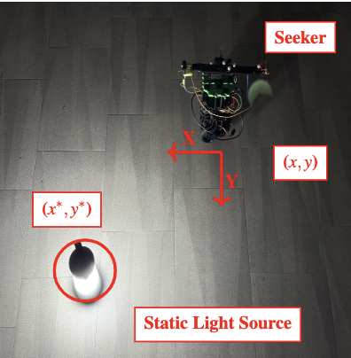

#### Note: for projects and work experience everything is ordered from present to past

## Education
1) San Diego State Univerity
   - Master of Science, Mechanical Engineering, Emphasis robotics, control, autonomous systems
   - August 2021 -> May 2024
   
2) California state university, Chico
   - Bachelor of science (BS), Mecatronics, Robotics and Automation Engineering
   - August 2013 -> May 2018

## Work Experience
1) San Diego State University
   
   - Graduate Research Assistant III:
   At the DSIM Lab, I collaborated with a research team dedicated to pursuing novel control theory approaches for autonomous systems, particularly focusing on the development of smart autonomous mobile robots. My role involved contributing to cutting-edge projects that push the boundaries of autonomous system capabilities. I led the development of an adaptive control approach extremum seeking control (ESC) implemented in ROS2 for mobile robots motion. The robot has no knowledge of its environment but with the real-time continuous optimization method the robot is able to perturb it's motion towards the source(designated by the designer, i.e. acoustic signal). This project demonstrated the practical application of advanced control theories in real-world robotic systems. This project compared previous methods with our novel design showcasing its superiority in efficiently reaching some optimal point(position unknown). Our method changed the movement of the sensor atop the robot therefore giving the system a wider search portfolio to locate the optimum point. This innovative approach employed information from a sensor to locate the source of the sound, or light in a room showcasing the potential of ESC in improving . My contributions have been pivotal in advancing the lab's research and development in smart robotics and control systems.
   - Teaching Assistant:
   As a Teaching Assistant for System Modeling and Robotics Control at SDSU, I was responsible for grading and evaluating student assignments and exams, ensuring fair assessment and providing constructive feedback to promote student learning. I collaborated closely with the course instructor to develop teaching materials and exercises that aligned with the curriculum, thereby enhancing the overall learning experience. Additionally, I acted as a liaison between students and faculty, advocating for student needs and contributing to the continuous improvement of course content and delivery. Systems Modeling and Analysis (Spring '24): Assisted in teaching an introductory course on control systems, focusing on system-level lumped parameter modeling of dynamic systems using first principles. Helped students understand and predict the performance of engineered systems based on their dynamic response prediction, and implement feedback control to achieve closed-loop stability and specified system performance. Robot Modeling Control (Fall '23): I served as a TA for a Robotic Model Control course, which focused on the design and implementation of control systems for robotics. The curriculum explored both forward and inverse kinematics, dynamics, sensor integration, and actuator control. In my role, I supported students through hands-on labs and projects, guiding them in using tools like MATLAB and ROS to model, and simulate robotic behaviors.

2) Course Designer
   
   - As a freelance Course Designer for The Construct, I was responsible for optimizing and debugging ROS2 and Gazebo simulation environments to create an engaging and intuitive learning experience for students. This involved aligning the simulations with students’ learning curves, ensuring the environments were both challenging and approachable. By fine-tuning these platforms, I enabled students to explore robotics concepts while building confidence in their skills. One of my key contributions was designing and implementing an image recognition system for a simulated security robot. Using convolutional neural networks (CNNs), I developed a framework that allowed the robot to identify and classify various objects within a virtual environment. This project involved leveraging ROS2 for communication between the robot’s perception and decision-making systems and using Gazebo to create a realistic testing area for students. This hands-on setup not only demonstrated the synergy between computer vision and robotics but also provided a practical, scalable approach for students to experiment with deep learning in a robotics context. In addition, I engineered a framework that integrated computer vision techniques and neural networks, focusing on their real-world applications in robotic perception and decision-making. By guiding students through the process of designing, implementing, and testing CNNs in a robotics environment, the course enabled them to develop both theoretical understanding and practical skills. This blend of robotics and AI helps students gain a strong foundation for tackling challenges in autonomous systems and intelligent automation.
   - Skills: python, programming, computer vision, deep learning, ROS2
  
   
3) Field Engineer II
   
   - As a Field Engineer II at Honeywell Process Solutions in San Bruno from April 2019 to March 2022, I served as the principal technical expert on HVAC systems, with a focus on the integration and maintenance of commercial Fire Alarm, Security, and Access Control Systems. My role involved spearheading the troubleshooting and resolution of startup issues, where I employed advanced diagnostic skills to ensure optimal equipment performance and reliability. I was pivotal in developing and programming building management controls using Honeywell software, which significantly improved the operational efficiency of buildings. This involved not only designing solutions that met client needs but also implementing them effectively to achieve measurable enhancements in system performance. Additionally, I led instructional sessions for subcontractors on electrical and mechanical system installations, fostering a culture of knowledge sharing and collaboration. Mentoring junior field service representatives was another key aspect of my role. I provided guidance and training in technical skills, customer service, and troubleshooting techniques, ensuring that the team was well-equipped to handle complex challenges. This mentorship not only improved team performance but also contributed to the professional growth of the individuals I worked with. My tenure at Honeywell Process Solutions was marked by a commitment to excellence, continuous improvement, and a dedication to fostering a collaborative and knowledgeable work environment.
      
   
   
   
 
 
 
 
 
 
 
 
 
 
 
 

## Projects

1) Thesis project

- The masters project consists of experimenting with different control theories with robots and autonmous systems. Our lab was interested in extremum seeking control which is an adaptive control approach widely research mainly to expand on the theory but the lab focussed more on the implementation of the methods on real robots, and testing in simulation.  The robot for my project was using a turtlebot3 from Robotis. This is a nonholnomic robot as it can only move in x-axis for forward velocity and angular velocity in the z-axis. It is a modular design which allowed me to make adjustments for the project, in my case an extra servo motor for the rotating sensor. The rotating sensor moves back and forth to get an estimation of the source in our case we used light and sound as some possible scalar signals. With this estimation the local exploration based on the servos motion calculates the derivative estimation of signal which perturbates the motion of the nonholonomic vehicle toward the source.  This robot has no knowledge of where the actual source is only that it is able to get a gradient estimate which should reveal the true derivative of the signal allowing the vehicle to converge. When I mean converge it essentially states that the vehicle is able to get within 0.5m from the source. 
This project required using hardware software and mechanical engineering skills in order to achieve the final design.  I added an extra layer to the top of the robot due to its modularity and by designing the parts in ONshape (similar to solidworks) in order to then use a 3D printer to get the rotating arm which attaches to the servo motor atop the robot. with the arm we need to attach a sensor that would detect light which turns out to be a photoresistor diode which measures the change in resistance as the sensor detect light intensity. 
The brain of our system is using a raspberry pi 4 which was helpful since it is compact and does not drain the on board battery the main thing that deplets the battery are the wheels. 
Now I did not start doing testing on the vehicle immediately in order to test how well the algorithm would work on a real robot I first needed a simulation to test out the theory and not damage any of the existing parts. this is where gazebo simulator became useful (similar to MujoCoo and IssacSim) designing the simulation with help from some teammates we designed a general framework for the simulator to use both the 

 
 
 
 
 
 

2) Optimization Path Planning project:

   -  Optimization problem where I needed to use some select and justify the use of some optimal control problem this was meant for a 2nd order system design but it mainly focus on using some first order techniques for optimal control theory. The methodology behind this had to do with optimizaing path planning for autonomous robots using duality and simplex method within the linear programming framework. I formated the objective function to incorporate the effect of the energy, weight, distance to source and obstacle proabability along with there arbitrary weight values to evaluate what the most efficient cost value. To emphasize the purpose of the project we are not using any dynamics or physical implementation the purpose was to get a deeper understanding of the concepts in how to work with linear programming techniques. From a nonlinear problem it was simplified to become a linear one in order for it to be analyzed with the techniques used for the course. Mainly focussed on using the simplex method and duality principle for getting some results for the optimization techniques.  The simplex method provides a way to move from one vertex of the feasible region to another ensuring that each step is closer to the optimal solution. The duality principle converts the objective function into a dual problemm or by forming the lagrangian of a minimization problem by using lagrange multipliers and adding them to the objective function while getting a solution to the primal variables which functions as dual variables.  The new objective function is set to minimize the function given the dual variables with nonnegative constraints. With these two methods that were used we are able to get results that minimize the cost the goal of the project was to test different methods not find the most optimal gain values for, this was outside the scope.
     $$J(x) = \alpha x_1 + \beta x_2 + \gamma x_3 + \delta x_4 $$
   -  where we have x_1 is energy, x_2 is the weight of the robot, x_3 is the distance give as a function for primary path with the adjusted path including a penalty(gain) for each one and finally x_4 represents the possiblity of an obstacle being in the path of the robot. With this equation we can employ the simplex method using the Gurobi optimazation library to find the optimal path based on the feasible region defined by these constraints methodically advancing towards an optimal solution 
   -  Skills used for the project: Optimiztion, duality, python, gurobi optimizer library

3) Autonomous systems CNNs how bad weather affects the safety of autonomous driving

   - The research paper on improving detection and prediction of noisy environments using deep learning and computer vision. Autonomous vehicles use different types of sensors to interpret their environments there is a controversial debate about how many sensors are actually needed for the vehicle to safely transport passengers to there destinations without any need for human intervention. Level 5 autonomy is seemly more achievable but can it be done with minimal sensors which would reduce cost for each unit (vehicle) produced to be autonomous? I explored the current research being done on to analyze the challenges computer vision and camera have been if bad weather is encountered. We focus on camera sensor and the difficulties that can happen rendering the vehicle unsafe potentially for passengers. Convolutional neural networks are integrated with recurrent nueral networks (RNN) to classify the sort of adverse weather conditions present in the surroundings, and these deep neural networks are used to extract visual characteristics from video frames.  We analyzed three different designs that are currently being used to research computer vision and weather, using deeep neural networks with algorithms such as YOLO, GRAMME, ReViewNet. Each method performs different defuzzing of images and eliminates false edge detection to assis the vehicle and understanding how to help with ensuring it can see in front of itself. The research studied rain, snow, hail and fog along with a couple of weather environments from this we were able to determine that the snow and fog were very challenging for the camera to identify objects where the precision went down by more than 20% for each of the methods.  Even with all the others they average around 50% precision which is less than ideal for the autonoumous vehicle. when the images get obscured it makes it very hard for the algorithm to enable the vechile to react if it cannot perceive its environment properly. we also know that the learning algorithms are realiant on the data and all th reseraach we found was using differnet data sets which makes it hard to make a true comparison. The more data you have the better but ths can also
   - Skills: Research, technical writing, deep learning, computer vision, autonomous vehicles 

4) Undergrad project robot pet waste collector
- The pet waste collection robot was designed to autonomously navigate a customer's yard, identify pet waste, and efficiently collect and dispose of it. As a team of four seniors with limited experience in computer vision and autonomous navigation, this project presented significant challenges; however, it allowed us to develop our problem-solving skills and quickly acquire new technical knowledge. 
Our primary focus was on developing the pickup mechanism and the computer vision algorithm for waste identification. We engineered a novel pickup system utilizing a 3D-printed "spike" puck that effectively punctures the waste and deposits it into an onboard waste container. The computer vision component employed a convolutional neural network trained on approximately 10,000 images of pet waste, achieving an accuracy of around 89% in correct identification.
- Skills: teamwork, CAD, coding, python, CNN, computer vision, fabrication, electronics, debugging

 
 
 
 
 
 
 
 
 
 
 

### Publications

<a id="1">[1]</a> 
James-Kavanaugh D., McNamee P. (2025). 
Servos for Local Map Exploration Onboard Nonholonmic Vehicles for Extremum Seeking
published to the IEEE controls systems and transactions journal. 
IEEE Transactions and Control Systems.
   
**Abstract:**

*Extremum seeking control (ESC) often employs perturbation-based estimates of derivatives for some  sensor field or cost function. These estimates are generally obtained by simply multiplying the output of a single-unit sensor by some time-varying function. Previous work has focused on sinusoidal perturbations to generate derivative estimates with results for arbitrary order derivatives of scalar maps or higher order derivatives of multivariable maps.  This work extends the perturbations from sinusoidal to bounded periodic or almost periodic functions and considers multivariable maps. A necessary and sufficient condition is given for determining if time-varying functions exist for estimating arbitrary order derivatives of multivariable maps for any given bounded periodic or almost periodic dither signal. These results are then used in a source seeking controller for a nonholonomic vehicle with a sensor actuated by servo. The conducted simulation and real-world experiments demonstrate that by distributing the local map exploration to a servo, the nonholonomic vehicle was able to achieve a faster convergence to the source.*
