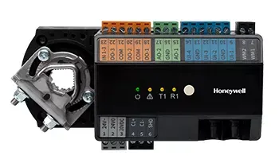

#### Note: for projects and work experience everything is ordered from present to past

## Education
1) San Diego State Univerity
   - Master of Science, Mechanical Engineering, Emphasis robotics, control, autonomous systems
   - August 2021 -> May 2024
   
2) California state university, Chico
   - Bachelor of science (BS), Mecatronics, Robotics and Automation Engineering
   - August 2013 -> May 2018

## Work Experience
1) San Diego State University
   
   - Graduate Research Assistant III:
   At the DSIM Lab, I collaborated with a research team dedicated to pursuing novel control theory approaches for autonomous systems, particularly focusing on the development of smart autonomous mobile robots. My role involved contributing to cutting-edge projects that push the boundaries of autonomous system capabilities. I led the development of an adaptive control approach extremum seeking control (ESC) implemented in ROS2 for mobile robots motion. The robot has no knowledge of its environment but with the real-time continuous optimization method the robot is able to perturb it's motion towards the source(designated by the designer, i.e. acoustic signal). This project demonstrated the practical application of advanced control theories in real-world robotic systems. This project compared previous methods with our novel design showcasing its superiority in efficiently reaching some optimal point(position unknown). Our method changed the movement of the sensor atop the robot therefore giving the system a wider search portfolio to locate the optimum point. This innovative approach employed information from a sensor to locate the source of the sound, or light in a room showcasing the potential of ESC in improving . My contributions have been pivotal in advancing the lab's research and development in smart robotics and control systems.
   - Teaching Assistant:
   As a Teaching Assistant for System Modeling and Robotics Control at SDSU, I was responsible for grading and evaluating student assignments and exams, ensuring fair assessment and providing constructive feedback to promote student learning. I collaborated closely with the course instructor to develop teaching materials and exercises that aligned with the curriculum, thereby enhancing the overall learning experience. Additionally, I acted as a liaison between students and faculty, advocating for student needs and contributing to the continuous improvement of course content and delivery. Systems Modeling and Analysis (Spring '24): Assisted in teaching an introductory course on control systems, focusing on system-level lumped parameter modeling of dynamic systems using first principles. Helped students understand and predict the performance of engineered systems based on their dynamic response prediction, and implement feedback control to achieve closed-loop stability and specified system performance. Robot Modeling Control (Fall '23): I served as a TA for a Robotic Model Control course, which focused on the design and implementation of control systems for robotics. The curriculum explored both forward and inverse kinematics, dynamics, sensor integration, and actuator control. In my role, I supported students through hands-on labs and projects, guiding them in using tools like MATLAB and ROS to model, and simulate robotic behaviors.

2) Course Designer
   
   - As a freelance Course Designer for The Construct, I was responsible for optimizing and debugging ROS2 and Gazebo simulation environments to create an engaging and intuitive learning experience for students. This involved aligning the simulations with students’ learning curves, ensuring the environments were both challenging and approachable. By fine-tuning these platforms, I enabled students to explore robotics concepts while building confidence in their skills. One of my key contributions was designing and implementing an image recognition system for a simulated security robot. Using convolutional neural networks (CNNs), I developed a framework that allowed the robot to identify and classify various objects within a virtual environment. This project involved leveraging ROS2 for communication between the robot’s perception and decision-making systems and using Gazebo to create a realistic testing area for students. This hands-on setup not only demonstrated the synergy between computer vision and robotics but also provided a practical, scalable approach for students to experiment with deep learning in a robotics context. In addition, I engineered a framework that integrated computer vision techniques and neural networks, focusing on their real-world applications in robotic perception and decision-making. By guiding students through the process of designing, implementing, and testing CNNs in a robotics environment, the course enabled them to develop both theoretical understanding and practical skills. This blend of robotics and AI helps students gain a strong foundation for tackling challenges in autonomous systems and intelligent automation.

3) Field Engineer II
   
   - As a Field Engineer II at Honeywell Process Solutions in San Bruno from April 2019 to March 2022, I served as the principal technical expert on HVAC systems, with a focus on the integration and maintenance of commercial Fire Alarm, Security, and Access Control Systems. My role involved spearheading the troubleshooting and resolution of startup issues, where I employed advanced diagnostic skills to ensure optimal equipment performance and reliability. I was pivotal in developing and programming building management controls using Honeywell software, which significantly improved the operational efficiency of buildings. This involved not only designing solutions that met client needs but also implementing them effectively to achieve measurable enhancements in system performance. Additionally, I led instructional sessions for subcontractors on electrical and mechanical system installations, fostering a culture of knowledge sharing and collaboration. Mentoring junior field service representatives was another key aspect of my role. I provided guidance and training in technical skills, customer service, and troubleshooting techniques, ensuring that the team was well-equipped to handle complex challenges. This mentorship not only improved team performance but also contributed to the professional growth of the individuals I worked with. My tenure at Honeywell Process Solutions was marked by a commitment to excellence, continuous improvement, and a dedication to fostering a collaborative and knowledgeable work environment.
      
   
   
   
 
 
 
 
 
 
 

## Projects

1) Thesis project

My project was discussed in the previous section on my work experience at SDSU but to gain a better understanding if we first understand what the robot looks like it will give a better understanding of what is happening.  We are using the robot known as the turtlebot3 from the company Robotis. It is a modular design with the ability to add layers or in my case an extra servo motor for the rotating sensor. The rotating sensor moves back and forth to get an estimation of the source in our case we used light and sound as some possible scalar signals. With this estimation the local exploration based on the servos motion calculates the derivative estimation of signal which perturbates the motion of the nonholonomic vehicle toward the source.  This robot has no knowledge of where the actual source is only that it is able to get a gradient estimate which should reveal the true derivative of the signal allowing the vehicle to converge. When I mean converge it essentially states that the vehicle is able to get within 0.5m from the source. 
This project required using hardware software and mechanical engineering skills in order to achieve the final design.  I added an extra layer to the top of the robot due to its modularity and by designing the parts in ONshape (similar to solidworks) in order to then use a 3D printer to get the rotating arm which attaches to the servo motor atop the robot. with the arm we need to attach a sensor that would detect light which turns out to be a photoresistor diode which measures the change in resistance as the sensor detect light intensity. 
The brain of our system is using a raspberry pi 4 which was helpful since it is compact and does not drain the on board battery the main thing that deplets the battery are the wheels. 
Now I did not start doing testing on the vehicle immediately in order to test how well the algorithm would work on a real robot I first needed a simulation to test out the theory and not damage any of the existing parts. this is where gazebo simulator became useful (similar to MujoCoo and IssacSim) designing the simulation with help from some teammates we designed a general framework for the simulator to use both the 

 
 
 
 
 
 

2) course design more in depth on the course design we used gazebo and ros in order to design a deep learning course there were multiple parts to the course which can be found on the construct website which is used to teach industry folks students and anyone who wants to get into the robotics software development industry how to work with the code and create worlds with simulation and test different methods and theories without needing to buy a robot. 

3) Undergrad project robot pet waste collector
Pet waste collector robot that was intended to be a robot that can autonomously navigate an area identify pet waste and collect it. Very complicated project that frankly was too much for some seniors to deal with having no experience with autonomous vehicles. We designed a novel pickup mechanism for the robot as well as the computer vision detection of pet waste up to 89% accuracy in identifying pet waste (lots of photos were needed) with that in mind we then were able to focus on the pet pickup mechanism which used a spike puck in order to get the the poop no vacum no scooping mechanism instead the puck would apply pressure and then absorb the poop in the puck.

### Publications

<a id="1">[1]</a> 
James-Kavanaugh D., McNamee P. (2025). 
Servos for Local Map Exploration Onboard Nonholonmic Vehicles for Extremum Seeking
published to the IEEE controls systems and transactions journal. 
IEEE Transactions and Control Systems.
   
**Abstract:**

*Extremum seeking control (ESC) often employs perturbation-based estimates of derivatives for some  sensor field or cost function. These estimates are generally obtained by simply multiplying the output of a single-unit sensor by some time-varying function. Previous work has focused on sinusoidal perturbations to generate derivative estimates with results for arbitrary order derivatives of scalar maps or higher order derivatives of multivariable maps.  This work extends the perturbations from sinusoidal to bounded periodic or almost periodic functions and considers multivariable maps. A necessary and sufficient condition is given for determining if time-varying functions exist for estimating arbitrary order derivatives of multivariable maps for any given bounded periodic or almost periodic dither signal. These results are then used in a source seeking controller for a nonholonomic vehicle with a sensor actuated by servo. The conducted simulation and real-world experiments demonstrate that by distributing the local map exploration to a servo, the nonholonomic vehicle was able to achieve a faster convergence to the source.*
